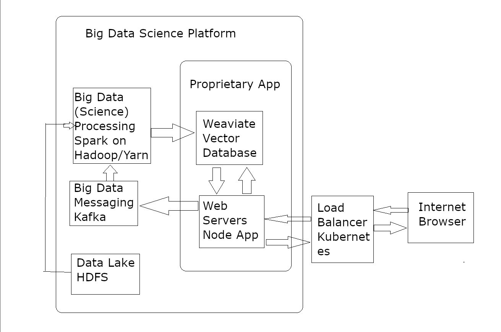

# BachMatch

## Participants / Team Members

| Member Name    | Student Number |
| -------------- | -------------- |
| Tim Kuhn       | 8284060        |
| Hendrik Träber | 6367227        |
| Paul Brüderle  | 3224687        |
| David Kleiner  | 1622864        |
| Gülbahar Cogac | 5801309        |

<!--- ## TODO:

(This section gets deleted when everything is done)
Verfassen Sie eine Dokumentation, die den Aufbau, die Implementierung und die
Funktionalitäten der Anwendung beschreibt. Fassen Sie die Ergebnisse, Herausforderungen
und Lernerfahrungen in einem Abschlussbericht zusammen.

Dokumentation enthält Idee der Anwendung, Architektur, Entwurf, Screencast eines
Demos, etc. in der Datei README.md (keine verteilte Dokumentation)

Dokumentation, die den Aufbau, die Implementierung und die
Funktionalitäten der Anwendung beschreibt. Fassen Sie die Ergebnisse, Herausforderungen
und Lernerfahrungen in einem Abschlussbericht zusammen.

## Topic: Finding the Perfect Academic Supervisor

Finding an academic supervisor who aligns perfectly with a student's research interests is a critical step in the success of any research project. Our program addresses this need by providing a systematic and efficient way for students to connect with supervisors whose expertise closely matches their research topics. By leveraging advanced search algorithms and a comprehensive database of academic profiles, we aim to make the process of finding the right supervisor both quick and accurate.

---->

## Objective

The primary objective of our program is to facilitate the matching process between students and academic supervisors. By inputting their research title and a brief summary, students can use our program to search through a curated database of potential supervisors. Each supervisor has listed their research areas and provided a description of their expertise. The program’s goal is to return the top 10 most suitable supervisors based on the relevance of their expertise to the student's research. This not only saves time but also enhances the quality of academic mentorship by ensuring a better fit between students and supervisors.

## Use-Case:

Students:

Graduate students can use our program to find the best academic supervisor for their research projects. They enter their project title and a brief abstract, and the program searches a database of supervisors. The program then provides a list of the top 10 supervisors whose expertise best matches the student's research topic. This process ensures that students find the most relevant and suitable supervisors efficiently.

## Datasets

- BetruerFertig.csv: This file contains data about supervisors, including their area of expertise and a detailed description of their research topics.
- extracted_abstracts.csv: This file contains data about students, including the title of their research project and an abstract.

## Structure

<!---[Grundaufbau gegeben, Anwendung basierend auf der Kappa-Architektur und Apache Spark als zentrale Technologie

Unsere Änderungen:

  Kurzerklaerung:
Nodejs Express Web-App, verbunden mit KAFKA zur Datenuebertragung,
Apache Spark nimmt die Eingaben des Abstracts und vektorisiert sie,
Spark schreibt das alles in eine Weaviate datenbank
von dort kann sich die Web-App die ergebnisse holen

kafka benutzt ein hadoop dateisystem

in weaviate werden 3 Sachen gespeichert:
Texte ueber wiss. Betreuer, und deren Vektoren
Beispiel Texte fuer 'wissen. arbeiten'
texte die die user eingeben haben

das alles wird in einem k8s ausgefuehrt. ]
---->

The foundation of our application is established by our professor, based on the Kappa Architecture and utilizing Apache Spark as the central technology. Below is an overview of the implementation and modifications:

#### Application Overview

The key components and technologies we used are as follows:

1. **Python Flask Web App**:

   - Provides a user interface for students to submit their research titles and abstracts.

2. **Kafka**:

   - Manages the data transmission between the web app and the processing system.
   - Utilizes a Hadoop file system for efficient data storage.

3. **Apache Spark**:

   - Processes the input data from Kafka.
   - Vectorizes the research abstracts for semantic analysis.

4. **Weaviate**:

   - Stores the vectorized data.
   - Facilitates the semantic search for matching supervisors.

5. **Kubernetes (k8s)**:
   - Deploys and manages the application, ensuring scalability and reliability.

#### Data Flow and Storage

1. **Data Input and Transmission**:

   - Students input their research titles and abstracts into the web application.
   - This data is transmitted to Kafka for further processing.

2. **Data Processing**:

   - Apache Spark processes and vectorizes the input data.
   - The processed data is then stored in Weaviate.

3. **Data Storage in Weaviate**:
   - **Supervisor Information**: Includes texts about academic supervisors and their vector representations.
   - **Example Research Texts**: Contains sample texts for various types of academic work.
   - **User Inputs**: Comprises texts and abstracts submitted by students.

By leveraging this architecture, our application efficiently processes and stores data, enabling the effective matching of students with the most suitable academic supervisors.

This is how the construct could look like:

## Implementation

The Database: Weaviate

- Weaviate holds objects, basically fancy tables. The supervisor object holds textual information and a TfIdfVector for their the personal statement. Weaviate supplies a function, where you can get near- vectors to some vector X.
- Example Abstracts is a weaviate object that contains example texts and their respective vectors. The Fronted allows to query this vector against the supervisor's vectors and get the 10 nearest.

The Frontend:

- the frontend uses Flask
- contains 3 main pages, a Homepage, Example Abstracts in a list linking to their detail pages and an input page where users can input text into the fields 'Topic', 'Title' and 'Abstract'.
- on the detail pages for the example abstracts there is a button that gets the 10 nearest vectors
- the user input gets successfully transmitted to the kafka cluster via the kafka-python module -- the fronted is a producer for kafka
- on startup the server handles cleaning and setting up the weaviate database so it is ready to use

Spark:

- is basically just a fancy data mover. we are using spark to communicate with a kafka cluster and then load this data gotten from kafka into weaviate
- spark is a consumer for kafka
- see the cluster/spark-app for technical details

Kafka:

- contains a single topic where the frontend puts user input text

## Functionality

The frontend shows a website that the user can connect to.

On this frontend the user can write their own text into fields and the system should (but doesn't) use this text, vectorize and show a near-vector based search for pre-computed vectors of scientific supervisors.

The user can also navigate to the example abstracts page where they might choose any of the abstracts to make a vector database request for a fitting supervisor.

The near-vector search for user input texts does not work, because the spark connector for weaviate has an issue that is currently unfixable (i think) in which it does not actually write the data to weaviate.

## Challenges and Learnings

In this project, we aimed to design and implement a robust distributed big data system utilizing Weaviate database, Apache Kafka, Spark, and Python Flask as the frontend. The following sections outline the significant challenges faced during this endeavor.

#### Ineffective Integration of PySpark-Weaviate Connector

One of the most pressing issues was the inability of the PySpark-Weaviate connector to write data into the database, rendering the system partially functional. This limitation resulted in an incomplete implementation and hindered the achievement of our project objectives.

#### Redundancy in Spark Utilization

The initial design employed Apache Spark for handling text vectorization tasks. However, upon further analysis, it was determined that Weaviate could have executed these operations more efficiently. The excessive use of Spark in this context proved to be redundant and added unnecessary complexity to the system.

#### Excessive Resource Intensiveness of Kubernetes Services

Perhaps the most critical challenge faced during this project was the substantial resource consumption caused by the sheer number of services managed by Kubernetes. The intricate web of interconnected components resulted in a system that is not only difficult to manage but also significantly resource-intensive, making it challenging to scale effectively without encountering performance bottlenecks.

#### Next Time: Don't use Spark, there is weaviate for that

our application would work if we would only use weaviate and not have spark and kafka in the system as this significantly increases cluster size (with hadoop clusters for spark and such) and as weaviate already contains vectorization algorithms, spark basically got delegated to a fancy data mover.
